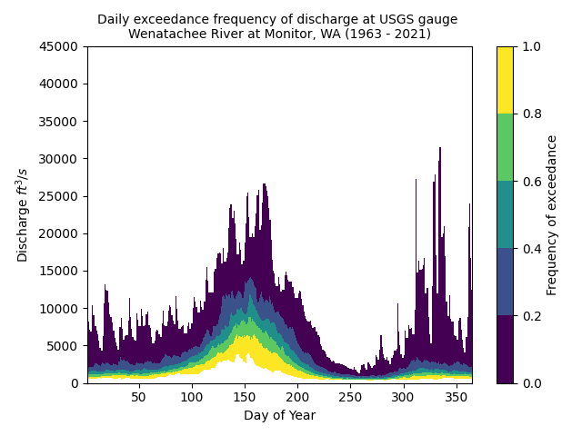
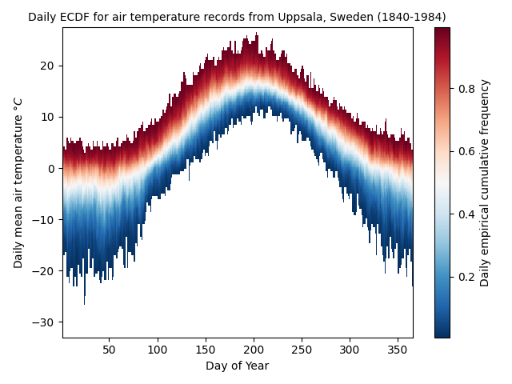

 [Code projects currently on Github](#code-projects-currently-on-github)


# Code projects currently on Github

## eplines
[eplines repository](https://github.com/rhkarls/eplines)

[eplines on pypi](https://pypi.org/project/eplines/)

A small visualization package producing empirical and exceedance probability/frequency heatmaps and cycle plot of many or long time-series.

Can for example be used to visualize exceedance frequency at different times of the year for streamflow timeseries. Basically a flow-duration curve for each day of the year:

The above graph shows the cumulative frequency of streamflow for each day of the year, so how often specified discharges were equaled or exceeded over the year. Low flows are execeeded often with values closer to 1, with 1 being exceeded 100% of the time. Extreme high flows occur less seldom has lower exceedance frequency.

Or the frequency distribution over the year for air temperature time series:

## kdlines 
[kdlines repository](https://github.com/rhkarls/kdlines)

[kdlines on pypi](https://pypi.org/project/eplines/)

Similar to eplines, this is a small visualization package producing kernel density heatmaps of many or long time-series. 

## sondera
[sondera repository](https://github.com/rhkarls/sondera)

[sondera on pypi](https://pypi.org/project/sondera/)

sondera is a python package providing clients for accessing Swedish hydrology and meteorology related open data. Currently supports SMHI open data APIs metobs and hydroobs for meteorological and hydrological observations, and basic support for SGU groundwater levels. 

sondera is currently at a very early stage, but functional for basic retrival of data.
## gohbv
[gohbv repository](https://github.com/rhkarls/gohbv)

This is a go (golang) implementation of the HBV hydrological model. The aim of this project was to learn go. The current state is quite rough, but the model is functional.

Future plan is to provide a cli for gohbv and make the model more user friendly.

## stevens-connect-client
[stevens-connect-client repository](https://github.com/rhkarls/stevens-connect-client)

Python API client for Stevens-Connect ([https://stevens-connect.com/](https://stevens-connect.com/)) cloud data acquisition system. Currently supports data retrival to pandas Series and DataFrames.

## sensormanager-client
[sensormanager-client repository](https://github.com/rhkarls/sensormanager-client)

Python API client for sensormanager.net cloud data acquisition platform. This project was an interesting learning experience since the API is not documented or officially supported, and the authentication and data retrival which this client provides has been reverse-engineered.
